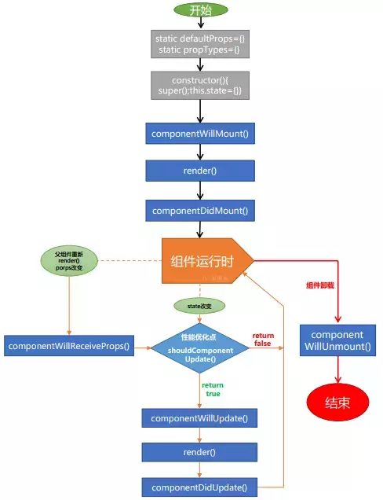

# react

## react 的生命周期图解



## note

- 由于 JSX 编译后会调用 React.createElement 方法，所以在你的 JSX 代码中必须首先声明 React 变量。
- 首字母必须大写，否则会被编译器认定为 html 标签
- react 元素的不可变性，如果需要更新需要重新组件一个组件，react 会负责优化和渲染？？将界面视为一个个特定时刻的固定内容（就像一帧一帧的动画），而不是随时处于变化之中（而不是处于变化中的一整段动画），将会有利于我们理清开发思路，减少各种 bug。当需要刷新 ui 时，render 会执行并且会对比上一帧的状态来决定更新哪一块
- false、true、null 或 undefined 不会渲染，0 会渲染
- props
  - children
    - 该属性为包含在组件内部的子组件
    - 如果只有一个子组件，则 children 表示子组件，否则所有子组件集合成一个数组，如下
    - 顺序从上到下依次为 children[0],children[1]...
- 使用 bind 绑定事件
  - onClick={this.clickHandle.bind(this,...args)}
  - clicnHandle(...args,\$e)
  - 事件对象放在最后面

## 事件绑定

> 默认组件方法不绑定 this，方法里面访问 this 为 undefined，并且如果需要传递参数，则事件对象作为最后一个参数传给方法

```javascript
//  in render func
<button className="test" onClick={this.testChange}>click</button>

//  methods
testChange(){
  console.log(this) // undefined
}

// in render bind this
// 下面的方法会在每次组件渲染时创建一个新的函数，可能会影响性能？？
<button onClick={(e)=>{this.testChange(e)}}></button>
<button className="test" onClick={this.testChange.bind(this,1)}>click</button>

// a=1 , e is Event
testChange(a,e){
  console.log(this) // Component ins
}

// or in constructor
<button className="test" onClick={this.testChange}>click</button>
constructor(props){
  super(props)
  this.testChange=this.testChange.bind(this)
}
//  属性初始化器语法
testChange=()=>{
  console.log(this)
}

```

## 获取 dom 引用

```javascript
// defined in class
constructor(props){
  this.myRef=this.createRef()
  this.inputDom=null
  this.setInputDom=d=>{
    this.inputDom=d
  }
}
render(){
  return(
    <div>
      <input ref={this.myRef} />
      <input ref={this.setInputDom}/>
    </div>
  )
}
componentWillMount(){
  //  usage
  let inputDom=this.myRef.current
}

//  defined in pure function
function InputItem(props){
  let dom=null
  return (
    <div>
      <input  ref={inputDom=>{dom=inputDom}}/>
    </div>
  )
}
```

## 数据传递

> 默认父子组件数据传递的方式是采用皮 props 的方式，如果需要跨越多层数据传递，则可以使用 Context 上下文。当应用规模较小的时候，app 层级的组件可以作为数据中心使用。

```javascript
import React from 'react';

//  数据上下文 通过 Context.Provider传递数据 Context.Consumer获取数据
const DataContext = React.createContext();
//  数据中心
const appData = {};
//  如何更新的问题???

class App extends React.Component {
  render() {
    return (
      <DataContext.Provider value={appData}>
        <ChildCom />
      </DataContext.Provider>
    );
  }
}

function ChildCom(props) {
  return (
    <DataContext.Consumer>
      {data => {
        //  data为appData
      }}
    </DataContext.Consumer>
  );
}
```

## 模块化 css

1. css 文件名，[filename].module.css
2. 引用，import style from 'css_path'.
3. [filename].css 不需要另外赋值，直接引入
4. 使用，className={style.className}

### 预编译 css【sass,scss,stylus】

1. npm install --save node-sass or yarn add node-sass /// npm install --save sass-loader???
2. scss 文件名. [filename].module.scss
3. import styles from [filename].module.scss
4. 直接引入 filename.scss 不需要另外赋值
5. 格式化 - install plugin 【Beautify css/sass/scss/less】【vscode】

## react-router-dom

> react 官方的路由管理库

1. 在根组建下面使用 <Router><App/></Router>即可，不需要每个组件下面使用
1. Router 作为记录历史记录的组件，作为 app 组件的 wapper，记录浏览历史记录

note:::

```javascript
//  重定向
<Route exact path="/" render={() => (
  loggedIn ? (
    <Redirect to="/dashboard"/>
  ) : (
    <PublicHomePage/>
  )
)}/>

//  页面之间传递参数
//  search 在 location对象中
Route component as this.props.location
Route render as ({ location }) => ()
Route children as ({ location }) => ()
withRouter as this.props.location

//  params 在match对象中
Route component as this.props.match
Route render as ({ match }) => ()
Route children as ({ match }) => ()
withRouter as this.props.match
matchPath as the return value
```

### 相关组件

> Route

三种渲染方式，[component|render|children]

```javascript
// 使用 component props渲染
<Route component={SomeComponent} path="/path" />
//  如果使用inline function 的方式，每次路由匹配都会卸载旧的组件，加载新的组件。
//  如从 /path/1 跳到 /path/2，如果使用上面的只会更新必要的界面
//  参数改变会触发【componentWillUpdate】钩子
<Route component={()=>{return <SomeComponent/>}} path="/path/:id" />

//  使用render inline function ,从 /path/1 跳到 /path/2，只有更新需要刷新的界面
<Route path="/path" render={(props)=>{return <SomeComponent />}} >
```

> Prompt

离开当前路由的弹窗确认。默认使用系统的 prompt，可以在 Router 组件上使用【getUserConfirmation】重写

```javascript
getUserConfirmation = (message, callback) => {
  //  ...重写方法 返回true 可以跳转，返回false，不需跳转
  return callback(true); // 允许跳转
};
```

### react-transition-group

> react-router 的路由转换动画组件

## react-redux

### redux

> 全局数据管理中心

1. action
2. 定义 types 和 actions
3. reducers
4. 定义接收 action 的动作
5. combineReducers
   1. 把所有 reducers 集中成一个
   2. combineReducers({reducer1,reducer2})
6. store
7. import {createStore } from 'redux'
8. const store= createStore(reducers)
9. export store

### react-redux

> react 官方的 readux 注入仓库

1. 注入 store
1. import {Provider} from 'react-redux'
1. import store from '/store/store.js'
1. index.js
   1. <Provider store={store}><App/></Provider>
1. 注入 state 和 action 到组件
1. connect(function(state){return {state:state}},{addAction})(componentName)
1. 注入到组件的 props 属性上

## react-motion

> react 动画组件

### spring

- spring: (val: number, config?: SpringHelperConfig) => OpaqueConfig
  - number 期望值
  - config 配置项
    - stiffness 刚性 值越大 刚醒越大
    - damping 振幅 值越大幅度越小
    - precision 精度值

### presets

```javascript
export default {
  noWobble: { stiffness: 170, damping: 26 }, // the default, if nothing provided
  gentle: { stiffness: 120, damping: 14 }, // 缓和
  wobbly: { stiffness: 180, damping: 12 }, //
  stiff: { stiffness: 210, damping: 20 }
};
```

### Motion

- style
- defaultStyle:?
- children
- onRest:?

### StaggeredMotion

### TransitionMotion

## react-transition-group
